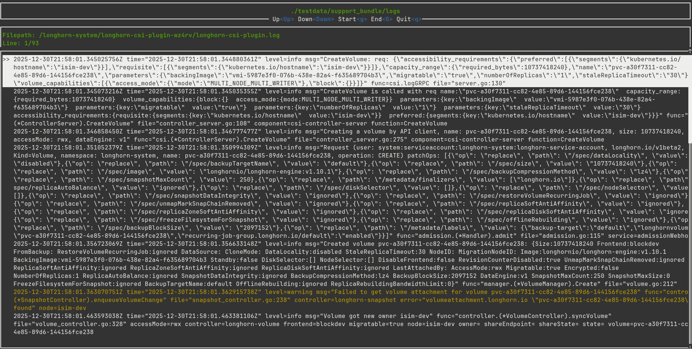

# sbsearch

`sbsearch` is a [Harvester support bundle][1] tool that search for keywords in the
resource logs and displayed them in chronological order. It uses the
[`grep` crate]() for fast searching and the
[`ratatui` crate](https://ratatui.rs/) for terminal user interface.




## Usage

To see general usage:

```sh
sbsearch -h
```

```sh
Usage: sbsearch --support-bundle-path <SUPPORT_BUNDLE_PATH> --keyword <KEYWORD>

Options:
  -s, --support-bundle-path <SUPPORT_BUNDLE_PATH>
  -k, --keyword <KEYWORD>
  -h, --help                                       Print help
  -V, --version                                    Print version
```

For example, to search for logs relevant to the PVC
`pvc-tg13d9d2-f7g3-46t1-770d-13wa01c36f01` in the support bundle located at
`~/Downloads/supportbundle_5t66d62c-u8a4-4311-8426-1d8493b2b576_2024-10-17T18-38-27Z`:

```sh
sbsearch \
  -s ~/Downloads/supportbundle_5t66d62c-u8a4-4311-8426-1d8493b2b576_2024-10-17T18-38-27Z \
  -r pvc-tg13d9d2-f7g3-46t1-770d-13wa01c36f01
```

Unarchive the support bundle before passing its path to `sbsearch`.

## Keymaps

### Line Navigation

Keys               | Actions
-------------------| -------
Up/Down arrow keys | Move up/down by one line
`g`                  | Go to the beginning of the log
`G`                  | Go to the end of the log

### Page Navigation

Keys                 | Actions
---------------------| -------
Left/Right arrow keys| Move left/right by one page
`0`                    | Go to the first page
`9`                    | Go to the last page

### Search

Keys | Actions
-----| -------
`/`    | Enter search mode
Enter| Execute search
`c`    | Clear search

### Others

Keys | Actions
-----| -------
`s`    | Save the current filtered logs to a file
`q`    | Quit the program

## Color Scheme

`sbsearch` uses the following color scheme to highlight different line context:

* warning in yellow
* error in red
* currently selected line in light magenta
* search matches in blue

## Development

To compile the code:

```sh
make check
```

To run unit tests:

```sh
make test
```

To run the program in debug mode:

```sh
make run SUPPORT_BUNDLE_PATH=<path_to_support_bundle> RESOURCE_NAME=<resource_name>
```

To build the release:

```sh
make release
```

## License

See [License](LICENSE).

[1]: https://docs.harvesterhci.io/v1.8/troubleshooting/harvester/#generate-a-support-bundle
